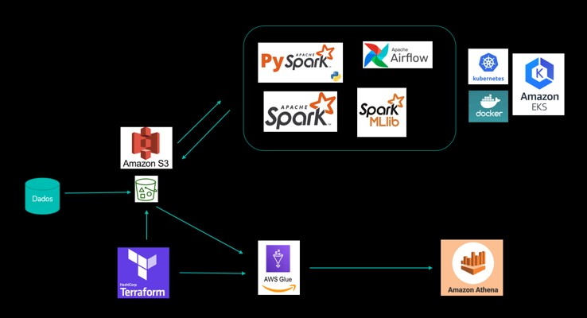

# Projeto Aplicado - Engenharia de Dados - MBA/XPE

O objetivo do projeto é o de proporcionar o tratamento de dados, armazenamento de dados processados e disponibilização de dados para duas finalidades distintas: uma focada nas análises de suporte de tomada de decisão, e outra com a finalidade de melhorar a personalização da experiência do usuário. Objetivou-se fornecer dados tratados e com valor adicionado que possa estar acessível por um DataWarehouse disponível em um serviço de Cloud permitindo extrair análises de duas naturezas distintas. A primeira natureza é um acompanhamento das métricas de desempenho do negócio. E a segunda é disponibilizar para clientes do Varejo E-commerce recomendações personalizadas. O usuário terá acesso a pelo menos uma plataforma para dar entrada a rotinas SQL para extrair informação dos dados. A maior parte da infraestrutura será construída em forma de código e estará em nuvem. O projeto deve ser concluído até Março de 2023.

# Arquitetura

A arquitetura construída para a solução, destaca-se na Figura 12 abaixo. Nela pode-se verificar que os dados serão distribuídos em 3 buckets no S3: um para ingestão, outro para processamento e outro para consumo. Dessa forma a estrutura de processamento formada pelo cluster Kebernetes consegue organizar os inputs e outputs e garante a transferência desses dados de maneira rápida e fácil através do AWS Glue Crawler para o serviço de DataWarehouse da AWS, o Athena, local onde os analistas poderão realizar as consultas necessárias e eventuais diligências de ações para rentabilização. A forma de construção da parte de buckets e serviços do Glue Crawler serão efetivadas por meio de estratégia IaC, conforme ferramental do Terraform.




# Construção e Deploy

As etapas para construção do projeto e seu deploy na cloud da AWS, de acordo com a arquitetura descrita acima, segue no roteiro abaixo:

<hr/>

## 0. Infraestrutura:

Para conseguir ter as estruturas de buckets e glue crawler na cloud da AWS, é necessário rodar o Terraform através dos actions do github. Para isso faça um pull request e de merge branch. Depois para fazer todo resto funcionar é importante que manualmente coloque os dados necessários no bucket de landing no S3. Eles serão tratados e processados segundo o cluster kubernetes que será descrito abaixo. Todos os códigos necessários estão no caminho dentro de "/infraestructure".

OBS: É de extrema importância que no secrets do repositório seja realizado a inserção de duas chaves de segurança para a conexão com a cloud da AWS. As duas chaves devem se chamar de AWS_SECRET_ACCESS_KEY e AWS_ACCESS_KEY_ID. Os valores a serem preechidos devem ser o mesmo que o disponibilizado pela conta na AWS.

OBS: O bucket de logs do terraform precisa estar criado no S3 antes de inciar o provisionamento. O nome do bucket deve ser: terraform-logs-gabriel

<hr/>

## 1. Ferramentas de Ambiente:

1. Instalar chocolately (windows) para realizar algumas etapas.

2. Criar repositório no github

3. Instalar o Rony. Link: https://github.com/A3Data/rony

4. Utilizar o Rony para construir as principais pastas e arquivos: rony new "nome do projeto"

5. Instalar o eksctl command line utility. Link: https://docs.aws.amazon.com/eks/latest/userguide/eksctl.html

<hr/>

## 2. Configurar chaves de acesso e região com o CLI da AWS:

Para conseguir se conectar com a cloud da AWS é necessário realizar a configuração das chaves de acesso. Para isso escreva o código abaixo e siga o preenchimento pedido.

```sh
aws configure
```

<hr/>

## 3. Criação de um cluster Kubernetes:

Criar um cluster kubernetes na aws com o comando:

```sh
eksctl create cluster \
--name=gabrielteste \
--managed \
--instance-types=m5.large \
--spot \
--nodes-min=2 \
--nodes-max=4 \
--region=us-east-2 \
--alb-ingress-access \
--node-private-networking \
--full-ecr-access \
--nodegroup-name=ng-gabrielteste \
--color=fabulous
```

OBS: o eksctl roda utilzando o AWS CloudFormation que é "um serviço que fornece aos desenvolvedores e empresas uma forma fácil de criar um conjunto de recursos relacionados da AWS e de terceiros para provisioná-los e gerenciá-los de forma organizada e previsível". Para verificar a criação do cluster entre na AWS dentro de CloudFormation e verifique dentro da região selecionada. É possivel olhar também dentro do EKS na AWS.

Para confirmar a criação do cluster, digite os comandos:

```sh
kubectl get nodes ou kubectl get namespaces.
```

Quando for necessário deletar o cluster basta rodar o código:

```sh
eksctl delete cluster \
--region us-east-2 \
--name gabrielteste \
--color=fabulous
```

Se fosse o caso de termos mais de um cluster kubernetes em outras clouds, seria interessante instalar o kubectx para realizar o manager desses cluster.

OBS: alguns comandos básicos do kubectl:

```sh
kubectl get nodes
```

```sh
kubectl get namespaces
```

```sh
kubectl get pods
```

```sh
kubectl get pods -n kube-node-lease
```

```sh
kubectl get pods -n kube-system
```

```sh
kubectl get svc -n kube-system
```

```sh
kubectl get deployments -n kube-system
```

```sh
kubectl get rs -n kube-system
```

```sh
kubectl get pv -n kube-system ou kubectl get pvc -n kube-system
```

<hr/>

## 4. Criação do dashboard no cluster kubernetes:

Para deployar o dashboard do kubernetes, visitar o link: https://github.com/kubernetes/dashboard.

1. Devemos rodar o seguinte código:

```sh
kubectl apply -f https://raw.githubusercontent.com/kubernetes/dashboard/v2.7.0/aio/deploy/recommended.yaml
```

2. Para verificar se o dashboard foi deployado rodar:

```sh
kubectl get namespaces
```

Fazer o seguinte passo a passo nos arquivos para preparar o deploy:
3. Criar pasta kubernetes no diretório principal.
4. Criar uma subpasta dashboard na pasta kubernetes
5. Criar arquivo yaml com nome serviceaccount.
6. Criar outro arquivo chamado rolebind.yaml (conteúdos estão dentro da pasta de config)

7. Entrar no diretório e deployar os recursos:

```sh
cd kubernetes 
```

```sh
kubectl apply -f dashboard
```

8. Criar secrets keys com o código:

```sh
kubectl -n kubernetes-dashboard create token admin-user.
```

9. Copiar a chave.

10. Rodar o código para startar o server:

```sh
kubectl proxy
```

Link para o dashboard: http://localhost:8001/api/v1/namespaces/kubernetes-dashboard/services/https:kubernetes-dashboard:/proxy/

11. Escolher token, e colar a chave criada no campo destacado logo quando entrar no dashboard.

Para deletar os recursos criados basta rodar os códigos:

```sh
kubectl delete -f dashboard
```

E para deletar o dashboard basta fazer:

```sh
kubectl delete -f https://raw.githubusercontent.com/kubernetes/dashboard/v2.7.0/aio/deploy/recommended.yaml
```

<hr/>

## 5. Criação e deploy do Airflow:

Para realizar o deploy do airflow siga esses passos para preparar os arquivos:
1. Instalar o helm localmente, visitar o link: https://helm.sh/docs/intro/install/
2. Abrir o powershell com permissão de administrador e rodar o código:

```sh
choco install kubernetes-helm
```

3. Já temos um cluster kubernetes rodando.
4. Criar pasta airflow dentro de kubernetes.
5. Utilizaremos a ferramenta Helm Chart, verificar link: https://airflow.apache.org/docs/helm-chart/stable/index.html
6. Rodar para verificar se já existe algum namespace do airflow. 

```sh
kubectl get namespaces 
```

7. Caso não exista rodar:

```sh
kubectl create namespace airflow
```

8. Verificar os serviços existentes dentro do namespace airflow com o código:

```sh
kubectl get all -n airflow
```

9. Vamos adicionar o helm chart com o seguinte comando:

```sh
helm repo add apache-airflow https://airflow.apache.org
```

```sh
helm repo update
```

10. Entrar na pasta kubernetes:

```sh
cd kubernetes
```

11. Rodar o código para adicionar arquivo yaml oficial do apache airflow:

```sh
helm show values apache-airflow/airflow > airflow/myvalues.yaml
```

12. Criar na root do projeto uma nova pasta de dags. Para estudar e realizar testes é possível criar uma task de exemplo com o link: https://airflow.apache.org/docs/apache-airflow/stable/tutorial/taskflow.html

13. Vamos modificar apenas alguns pontos do arquivo yaml do airflow:

* (Linha 233): Modificar para KubernetesExecutor
* (Linha 242): Modificar para termos logs. É preciso um bucket do S3 na mesma região.

```yaml
    - name: AIRFLOW__CORE__REMOTE_LOGGING
      value: 'True'
    - name: AIRFLOW__LOGGING__REMOTE_BASE_LOG_FOLDER
      value: "s3://testekuberneteslogs/airflow-logs/"
    - name: AIRFLOW__LOGGING__REMOTE_LOG_CONN_ID
      value: "my_aws"
```

* (Linha 379): Para adicionar o fernetKey, precisamos primeiro criar um arquivo dentro de airflow para gerar esta chave, através do fernet. O arquivo python, após rodar gerará uma chave. O conteúdo do python está em config. Colar o valor da chave no til da linha.

* (Linha 956): Na parte de Default User, trocar para as suas informações.
* (Linha 987): Trocar type por LoadBalancer. Sem isso, só conseguiremos acessar o link do webserver para ver a UI do airflow através de configurações manuais.

* (Linha 1507): Na parte de redis utilizaremos false.
* (Linha 1782): Utilizar o git sync, fazendo ficar true.

OBS: Antes de fazer mais modificações dar um push com branch dev no git pra salvar e preparar para quando futuras modificações ocorrerem o airflow identificar o evento. Entrar na branch dev do github e coletar o link https do repositório.

* (Linha 1788): colar link do repositório.
* (Linha 1789): trocar por branch dev.
* (Linha 1796): trocar pelas nossas dags, com o path "dags". 

14. Feitas as modificações faremos o deploy. Vamos rodar o seguinte código:

```sh
helm install airflow apache-airflow/airflow \
-f airflow/myvalues.yaml \
-n airflow \ 
--debug
```

Caso tenha dado algum erro basta desinstalar com o código:

```sh
 helm uninstall airflow -n airflow.
```

Não esquecer de deletar os load balancers também, com o código:

```sh
kubectl delete svc airflow-websever -n airflow.
```

Deletar também o postgres, com o código:

```sh
kubectl delete pvc data-airflow-postgresql-0 -n airflow.
```

Verificaremos se está tudo certo:

```sh
kubectl get pods -n airflow
```

Para pegar o link do serviço do airflow rodar:

```sh
kubectl get svc -n airflow
```

Estará na coluna External-IP. Não esquecer de adicionar a porta :8080. Costuma demorar uns minutinhos até ficar disponível.

15. No Login do airflow utilizar as credenciais que foram definidas no arquivo myvalues.yaml. Após entrar no airflow devemos modificar modificar a senha de entrada no serviço, pois a senha de início é fraca "admin". Refazer a autenticação com nova senha.

16. Entrar em Admin, depois Connections e adicionar no botão de mais (+). Escolher no campo connection id um nome, como "my_aws". Escolher no tipo, Amazon web services. Adicionar as credenciais da AWS. Estará tudo pronto para triggar as suas DAGs.

OBS: Não esquecer de adicionar na lista de variáveis dentro do airflow, na parte de Admin as mesmas credenciais com nomes de aws_access_key_id e aws_secret_access_key.

<hr />

## 6. Criação e deploy do Spark no Kubernetes:

1. Devemos criar um namespace rodando: 

```sh
kubectl create namespace processing
```

2. Criaremos dentro da subpasta criada em kubernetes com nome spark, um outra pasta chamada jars e um dockerfile fora dela. Muito cuidado com as versões das libs, em especial quando se trata de spark, pois isso é muito crítico.

3. Com isso vamos buildar o dockerfile. Rode o comando: 

```sh
docker build -t gabrielnovais/spark-operator:v3.0.0-aws 
```

Esteja com o docker desktop aberto para verificar que localmente a imagem será criada e é interessante que já esteja logado por lá. É preciso fazer o login da sua conta no docker. 

4. Realize o login com o código:

```sh
docker login -u gabrielnovais -p minhasenha.
```

5. Vamos fazer o push da imagem para ficar disponível publicamente, com o código a seguir:

```sh
docker push gabrielnovais/spark-operator:v3.0.0-aws.
```

Feito o push pode verificar no docker hub que a imagem estará lá.

6. Coletar as funções jars no maven. Os links de download dos 4 arquivos jars são:

Em https://mvnrepository.com/:

* aws-java-sdk: https://repo1.maven.org/maven2/com/amazonaws/aws-java-sdk/1.7.4/aws-java-sdk-1.7.4.jar
* hadoop: https://repo1.maven.org/maven2/org/apache/hadoop/hadoop-aws/2.7.3/hadoop-aws-2.7.3.jar
* Delta: https://repo1.maven.org/maven2/io/delta/delta-core_2.12/1.0.0/delta-core_2.12-1.0.0.jar
* spark-sql-kafka: https://repo1.maven.org/maven2/org/apache/spark/spark-sql-kafka-0-10_2.12/3.0.1/spark-sql-kafka-0-10_2.12-3.0.1.jar

7. Criar um service account no kubernetes spark. Para isso rode o código:

```sh
kubectl create serviceaccount spark -n processing
```

8. Para entender as roles devemos verificar quais são as disponíveis. Para isso rode:

```sh
kubectl get clusterroles --all-namespaces.
```

9. Vamos criar uma role, para isso rode:

```sh
kubectl create clusterrolebinding spark-role-binding \
--clusterrole=edit \
--serviceaccount=processing:spark \
-n processing
```

10. Após criar o cluster role acima, pegue o arquivo yaml gerado e coloque na pasta do airflow, com nome: "rolebinding_for_airflow.yaml". Nele além do código que será originado, adicione o seguinte trecho de código para que o airflow tenha permissões:

```yaml
    apiVersion: rbac.authorization.k8s.io/v1
    kind: ClusterRoleBinding
    metadata:
      name: airflow-spark-crb
    roleRef:
      apiGroup: rbac.authorization.k8s.io
      kind: ClusterRole
      name: spark-cluster-cr
    subjects:
      - kind: ServiceAccount
        name: airflow-worker
        namespace: airflow
```

11. Após adicionar essas permissões para o airflow, devemos aplicar ao kubernetes com o código:

```sh
kubectl apply -f kubernetes/airflow/rolebinding_for_airflow.yaml -n airflow.
```

12. Para conseguir verificar se foi aplicado basta fazer:

```sh
kubectl get serviceaccount -n airflow.
```

Veja que o ariflow-worker está presente com o código

```sh
kubectl get clusterrolebinding -n airflow
```

Pode trocar o get pelo describe e adicione o nome desejado depois do nome anterior para verificar também.  

13. Precisamos criar um operator (responsável por criar novos recursos no kubernetes) para utilizar o spark application no kubernetes. Para fazer isso precisamos antes utilizar o helm:

```sh
helm repo add spark-operator https://googlecloudplatform.github.io/spark-on-k8s-operator.
```

Depois: 

```sh
helm repo update.
```

14. Então poderemos fazer a instalação do spark operator com o código:

```sh
helm install spark spark-operator/spark-operator -n processing.
```

Para verificar se o spark operator for deployado então é só fazer:

```sh
helm ls -n processing.
```

E depois de uma olhada com o código:

```sh
kubectl get pods -n processing
```

15. No bucket S3 devemos ter 3 pastas, uma para landing (bronze), ou para processar (prata) e outra para entregar (ouro), e uma pasta com os códigos em python com spark (codes). 

16. O user guide do spark-operator está em https://github.com/GoogleCloudPlatform/spark-on-k8s-operator/blob/master/docs/user-guide.md.

17. Verifique se o segredo já foi criado com o código:

```sh
kubectl describe secret aws-credentials -n processing.
```

Caso não tenha sido, crie utilizando a chave de acesso do aws, com o seguinte código:

```sh
kubectl create secret generic aws-credentials \
--from-literal=aws_access_key_id=meukeyid \
-from-literal=aws_secret_access_key=meusecretkey \
-n processing
```

18. Desse mesmo user guide pegue o exemplo de spark operator no k8 spark-py-pi.yaml e coloque na subpasta do spark no kubernetes. Vamos realizar algumas customizações nesse arquivo:

* (Linha 5): Troque para processing
* (Linha 6): Adicione
```yaml
    volumes:
        - name: ivy
          emptyDir: {}
    sparkConf:
        spark.jars.packages: "org.apache.hadoop-aws:2.7.3.org.apache.spark-avro_2.12:3.0.1"
        spark.driver.extraJavaOptions: "-Divy.cache.dir=/tmp -Divy.home=/tmp"
        spark.kubernetes.allocation.batch.size: "10"
    hadoopConf:
        fs.s3a.impl: org.apache.hadoop.fs.s3a.S3AFileSystem
```

* (Linha 19): troque pelo endereço da sua imagem, ou seja, por "docker.io/gabrielnovais/spark-operator:v3.0.0-aws"

* (Linha 21): adicionar endereço do bucket com s3a do código onde está o spark a ser executado em python, logo seria o bucket: "s3a://testekuberneteslogs/codes/spark-operator-processing-job-batch.py"

* (Linha 22): trocar versão para 3.0.0
* (Linha 24): trocar restart policy para o tipo Never, e deletar as linhas relacionadas.

* (Linha 25): dentro de driver escrever o seguinte código

```yaml
envSecretKeyRefs:
    AWS_ACCESS_KEY_ID:
        name: aws-credentials
        key: aws_access_key_id
    AWS_SECRET_ACCESS_KEY:
        name: aws-credentials
        key: aws_secret_access_key
```

* (Linha 35): Trocar memory por "4g"
* (Linha 37): Trocar por 3.0.0
* (Linha 38): abaixo dessa linha cole o seguinte código

```yaml
volumeMounts:
    - name: ivy
      mountPath: /tmp
```

* (Linha 42): repita o trecho da linha 25
* (Linha 50 e 51): trocar por 3
* (Linha 52): trocar por "4g"
* (Linha 54): Trocar por 3.0.0 e adicionar o trecho da linha 38.

19. Agora vamos realizar um deploy. Rode o código:

```sh
kubectl apply -f spark-batch-operator-k8s-v1beta2.yaml -n processing. 
```

Isso vai criar o job, criando um container driver no pod e nós executores. Após o job ser completado o driver ficará com o status completed, para ver isso rode:

```sh
kubexctl get pods -n processing.
```

Verifique que agora podemos rodar o código:

```sh
kubectl get sparkapplication -n processing.
```

Caso queira ver algo a mais do job olhar o comando describe do kubectl. Par coletar os logs do pod, pegue o nome do pod com o comando:

```sh
kubectl get pods -n processing
```
E depois disso rode o comando:

```sh
kubectl logs (nome do pod) -n processing.
```

<hr/>

## 7. Pipeline completa

1. Criar um namespace airflow e deployar o airflow (já feito)

2. Pegue o endereço do airflow-webserver e acesse a URL para ter a UI do airflow.

3. Dentro do airflow fazer uma nova conexão além da aws, que é a conexão com o kubernetes. Na conn id escrever um nome diferente com o kubernetes para associar (kubernetes_default por exemplo). No tipo escolher Kubernetes Cluster Connection. Selecionar a caixa de "In cluster configuration". Agora basta criar.

4. Os dados serão consumidos do bucket da landing zone. Os dados já devem estar lá para que possam ser utilizados. Para cada execução de código spark, precisamos utilizar um arquivo python com o spark e um yaml associado ao job, fora o python da própria DAG. Os códigos sparks que de fato executarão as transformações ficam dentro da pasta pyspark em dags. Essa pasta precisa estar no bucket que contém o folder codes, pois é de lá que esses códigos serão puxado para o cluster kubernetes. Sobre o preenchimento da DAG, em termos de cronograma de execução, pode-se utilizar o crontab guru para consultar como realizar esse cornograma. Em cada arquivo yaml associado ao arquivo pyspark devemos ter uma estrutura similar, mudando apenas o nome base e o nome do arquivo pyspark associado.

5. Os arquivos em pyspark devem ser:

* transformar de csv para parquet e salvar na zona de processing
* gerar as transformações para analytics
* salvar tabela na zona de consumer
* trigar o crawler para gerar tabela no athena
* gerar as transformações para recomendação
* salvar tabela na zona de consumer
* trigar o crawler para gerar tabela no athena

Podemos verificar o processo no airflow. Para verificar quais jobs estão rodando no cluster rode o código:

```sh
 kubectl get pods -n airflow --watch.
 ```

 Outro acompanhamento interessante seria olhar o spark application com o código:
 
 ```sh
 kubectl get sparkapplication -n airflow.
 ```

 Para acompanhar os logs de execução pegue o pod do driver por exemplo. Caso dê alguma falha por conta de recursos, é possível falhar o processo manualmente e matar os pods que estão pendentes com o kubectl delete + nome do pod.